# SECOM 기반 반도체 공정 센서 데이터 불량 예측 및 불균형 분류 분석

> 공개·익명화된 UCI/Kaggle SECOM 데이터셋으로 590개 센서 변수에서 불량(Fail) 판별에 기여하는 패턴을
> 모델링하고, 불균형 분류(imbalanced classification) 문제를 실제로 다뤄본 End-to-End 데이터 분석/ML 파이프라인.

**⚠️ 실제 Fab 원천 데이터가 아니라 공개·익명화된 데이터셋을 쓴 분석입니다.** 590개 센서 feature가 실제로 어떤
장비/공정/챔버를 가리키는지는 공개돼 있지 않습니다. 따라서 본 분석은 실제 공개 제조 데이터에서 익명 센서
변수와 Pass/Fail 라벨의 통계적 관계를 모델링한 사례로 한정하며, 실제 Fab의 물리적 원인 규명이나 공정 조건
최적화를 목적으로 하지 않습니다.

---

## 목차

1. [프로젝트 배경 및 문제 정의](#1-프로젝트-배경-및-문제-정의)
2. [데이터셋 설명 및 한계](#2-데이터셋-설명-및-한계)
3. [분석 아키텍처 / 프로세스](#3-분석-아키텍처--프로세스)
4. [EDA 핵심 인사이트](#4-eda-핵심-인사이트)
5. [전처리 전략](#5-전처리-전략)
6. [모델링 전략 및 데이터 누수 방지 원칙](#6-모델링-전략-및-데이터-누수-방지-원칙)
7. [모델 성능 비교](#7-모델-성능-비교)
8. [최종 모델의 Threshold 선택 근거](#8-최종-모델의-threshold-선택-근거)
9. [Feature Importance 해석 시 유의사항](#9-feature-importance-해석-시-유의사항)
10. [Spotfire 대시보드 구성 (외부 BI 툴)](#10-spotfire-대시보드-구성-외부-bi-툴)
11. [Interactive Analytics (저장소 코드 기반, Plotly Dash)](#11-interactive-analytics-저장소-코드-기반-plotly-dash)
12. [재현 방법](#12-재현-방법)
13. [폴더 구조](#13-폴더-구조)

---

## 1. 프로젝트 배경 및 문제 정의

반도체 제조 공정은 웨이퍼 한 장이 완성되기까지 수백 개의 공정 단계와 센서 계측을 거칩니다. 이 과정에서
쌓이는 센서 데이터로 최종 검사 전에 불량 가능성이 높은 제품을 미리 걸러낼 수 있다면 검사 비용과 수율 손실을
줄이는 데 도움이 됩니다.

실제 Fab 원천 데이터는 접근할 방법이 없어서, 공개 데이터셋인 SECOM(UCI/Kaggle)으로 같은 문제(불량 조기
판별)를 다뤄보기로 했습니다.

프로젝트 목표는 다음 네 가지로 정의했습니다. 590개 익명 센서 변수로 Pass/Fail을 예측하는 분류
모델을 만드는 것이 우선이었고, 불량 클래스가 6~7%밖에 안 되는 심한 불균형 상황이라 Accuracy 단독 기준의
모델 선정은 제외했습니다. 대신 Recall, Precision, F1, PR-AUC, ROC-AUC를 같이 놓고 비교하는
절차를 세우는 쪽에 시간을 더 썼습니다. 결측치, 590개짜리 고차원 피처, 데이터 누수처럼 실무에서 자주
걸리는 문제도 파이프라인 레벨에서 처리하고 싶었고, 마지막으로 이걸 코드/노트북 선에서 끝내지 않고 Spotfire
대시보드로 이어질 수 있는 형태로 정리하는 것까지가 목표였습니다.

## 2. 데이터셋 설명 및 한계

- 출처: [UCI Machine Learning Repository - SECOM](https://archive.ics.uci.edu/dataset/179/secom) /
  [Kaggle - uci-semcom](https://www.kaggle.com/datasets/paresh2047/uci-semcom)
- 구성: 1,567개 샘플 x 590개 익명 센서 feature + `Time`(타임스탬프) + `Pass/Fail`(라벨: -1=정상, 1=불량), 총 592열
- 라벨 변환: 원본 라벨 `-1`(정상)을 `0`(Pass)으로, `1`(불량)을 `1`(Fail)로 바꿔서 씁니다 (`src/data_loader.convert_labels`).
- 클래스 불균형: 불량 비율이 전체의 6~7% 정도로 꽤 낮습니다.

#### 한계

590개 feature는 익명화돼 있어서 실제 어떤 공정/장비/챔버인지 알 방법이 없습니다. 그래서 이 프로젝트에서는
이걸 특정 공정이라고 단정하지 않고 그냥 "익명화된 센서 변수"로만 다룹니다. Wafer X/Y 좌표, 장비 ID, Chamber
ID, Lot ID처럼 실제 제조 추적에 필요한 메타데이터도 없고, 데이터 자체도 2008년경 특정 소규모 Fab 환경에서
나온 것이라 반도체 공정 전체를 대표한다고 보기는 어렵습니다. 이 때문에 결론도 "공개 데이터에서 불량 판별에
통계적으로 기여하는 센서 패턴을 모델링해봤다" 정도로만 잡았고, 실제 Fab 공정의 물리적 인과관계를 밝힌 건
아닙니다.

## 3. 분석 아키텍처 / 프로세스

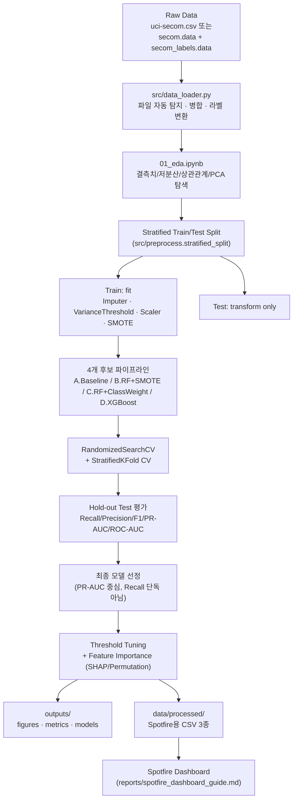

## 4. EDA 핵심 인사이트

아래는 실제 SECOM 데이터(`data/raw/uci-secom.csv`)로 `notebooks/01_eda.ipynb`를 돌려서 확인한 내용입니다
(`outputs/metrics/eda_summary.json`에도 저장됩니다).

행과 열부터 보면 1,567개 샘플에 590개 센서 feature, 여기에 Time·Pass_Fail 메타 컬럼까지 합쳐서 총
592열입니다. 중복 행은 없었습니다. 라벨 분포는 Pass 1,463건, Fail 104건, 불량률 6.64%로, 이 말은 곧
아무것도 안 하고 전부 Pass라고만 찍어도 정확도가 93%를 넘는다는 뜻입니다. 정확도로는 이 문제를 판단할 수
없다는 게 여기서부터 이미 분명했습니다.

결측치는 feature별 평균이 4.5%, 중앙값은 0.38%로 대체로 낮습니다. 그런데 최댓값이 91.2%까지 뜁니다. 일부
센서는 사실상 못 쓰는 수준이라, 결측 비율 임계값을 하나로 정하기보다 몇 가지로 나눠서 얼마나 잘려나가는지
먼저 비교해봤습니다.

| 결측 비율 임계값 | 제거 대상 | 유지 |
|---|---|---|
| 40% | 32개 | 558개 |
| 50% (모델링 기본값) | 28개 | 562개 |
| 70% | 8개 | 582개 |

상수이거나 분산이 거의 0인 feature가 127개, 분산 상위 feature 기준으로 상관계수 0.95를 넘는 쌍이 329개로,
둘 다 적지 않은 수치였습니다. 590개짜리 고차원 데이터라 다중공선성이 꽤 심할 거라 짐작은 했지만, 실제
숫자로 확인하고 나니 저분산/상수 변수 제거 단계를 파이프라인 앞쪽에 꼭 넣어야겠다는 판단이 섰습니다.

PCA로 2차원에 투영해봤습니다. 상위 두 주성분이 설명하는 분산은 각각 5.6%, 3.6%, 합쳐도 9.2%밖에 안
됩니다. Pass/Fail도 시각적으로 뚜렷하게 나뉘어 보이지 않았습니다. 다만 이 결과를 "모델이 잘 분류할 수
있다"는 근거로 쓰지는 않았습니다. 저차원 선형 투영에서 두 클래스가 분리되지 않는다고 해서 비선형 모델의
분류 가능성까지 부정되는 건 아니라서, PCA는 참고용으로만 남기고 실제 판단은 이후 모델 성능(PR-AUC)으로
넘겼습니다.

시간 구조도 확인했습니다. 데이터는 약 337일에 걸쳐 모였고 시간순 정렬은 안 돼 있었습니다
(`is_monotonic_time=False`). 월별 불량률이 2.0%에서 14.0% 사이를 오가긴 하는데 표준편차가 3.7%p 정도라
추세라고 부르기엔 근거가 약했습니다. 시간 기반 분할을 쓸 만한 뚜렷한 이유를 못 찾았다는 뜻이라, 기본
평가는 Stratified Random Split으로 정했습니다.

#### EDA 그래프

`outputs/figures/`에 저장되고, `notebooks/01_eda.ipynb`를 다시 돌리면 그대로 재생성됩니다.

<table>
<tr>
<td width="50%">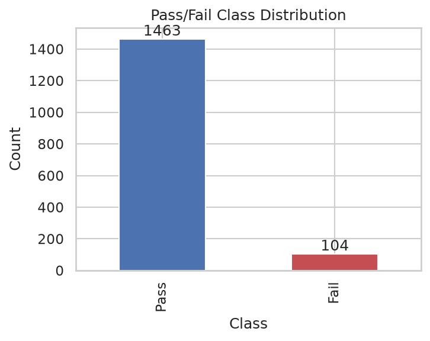</td>
<td width="50%">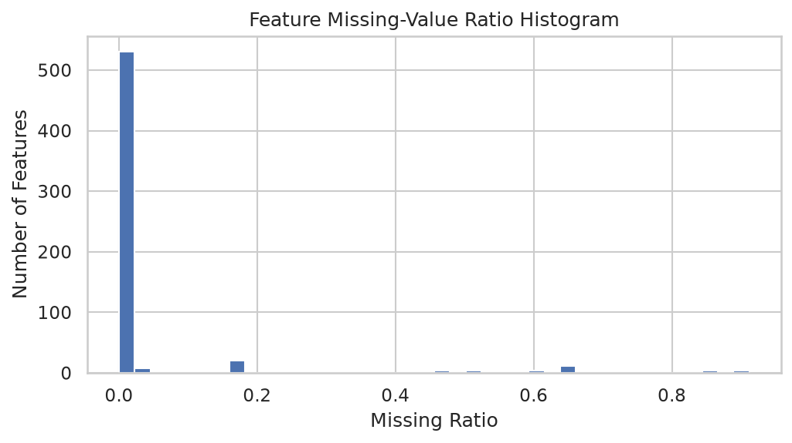</td>
</tr>
<tr>
<td width="50%">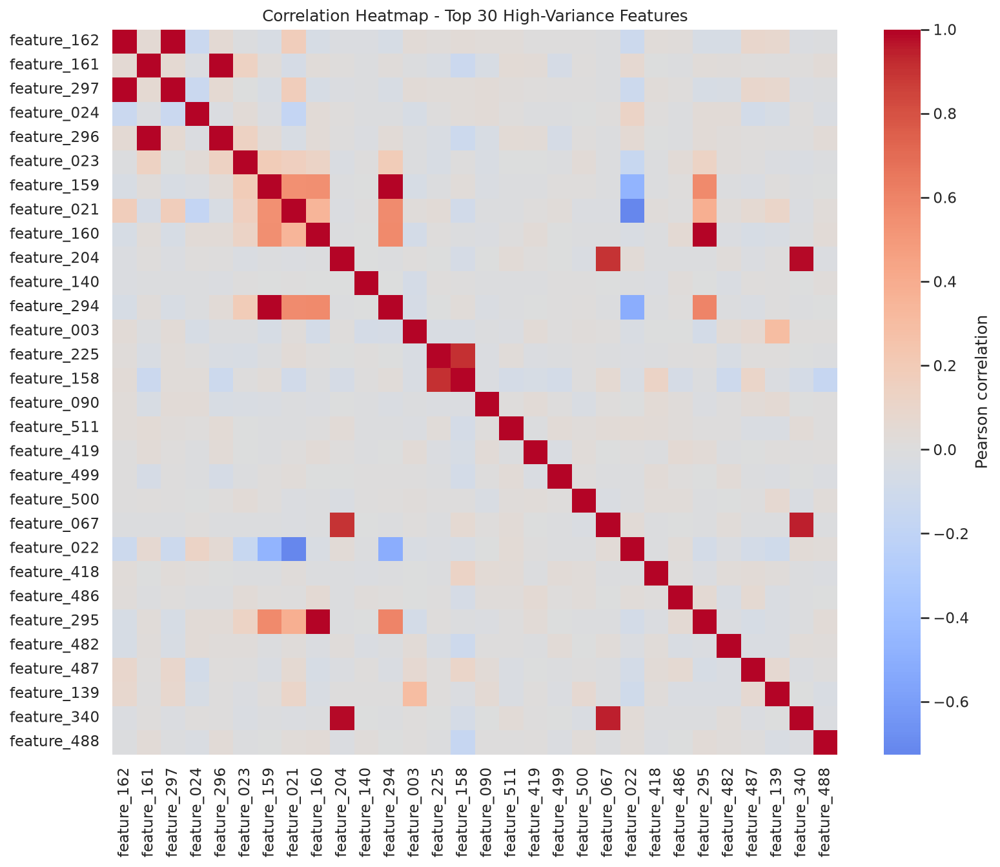</td>
<td width="50%">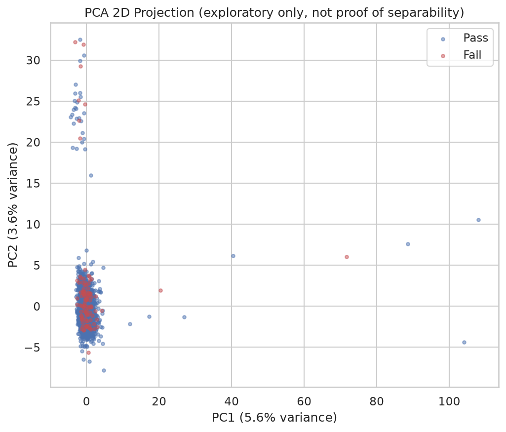</td>
</tr>
<tr>
<td width="50%">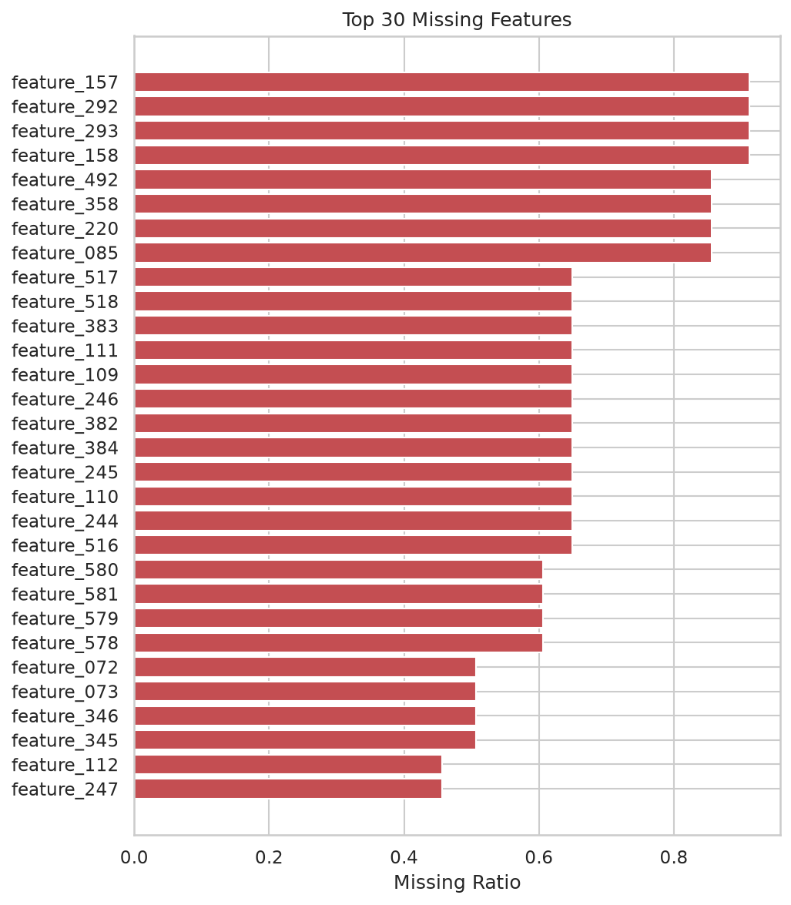</td>
<td width="50%">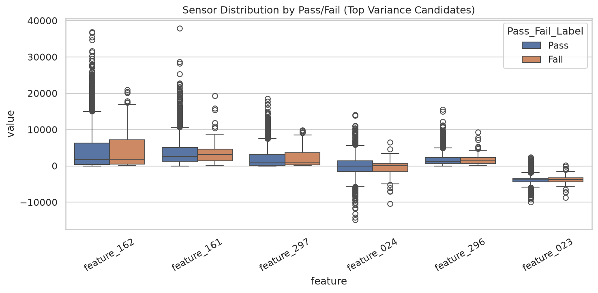</td>
</tr>
</table>

## 5. 전처리 전략

| 단계 | 방법 | 비고 |
|---|---|---|
| 컬럼명 생성 | `feature_000` ~ `feature_589` 명시적 이름 부여 | `src/data_loader.generate_feature_names` |
| 결측치 처리 | Median Imputation (train에서만 fit) | `sklearn.impute.SimpleImputer` |
| 고결측 변수 제거 | 결측 비율 임계값(기본 50%) 초과 컬럼 제거, train에서만 기준 산정 | `src/preprocess.MissingRatioDropper` (커스텀 transformer) |
| 저분산/상수 변수 제거 | 분산이 거의 0인 변수 제거 | `sklearn.feature_selection.VarianceThreshold` (결측 존재 시 `LowVarianceDropper`) |
| 스케일링 | Logistic Regression 등 스케일에 민감한 모델에만 적용 | `StandardScaler` |
| 불균형 처리 | SMOTE(오버샘플링) 또는 `class_weight='balanced'` 두 가지 방식을 비교 | `imblearn.over_sampling.SMOTE` |

결측치 비율 임계값은 40%/50%/70% 세 기준으로 제거 변수 수를 비교해봤고(`config.MISSING_RATIO_THRESHOLDS`),
실제 모델링 파이프라인에서는 50%를 기본값으로 씁니다(`config.MODELING_MISSING_THRESHOLD`).

## 6. 모델링 전략 및 데이터 누수 방지 원칙

#### 데이터 누수(Data Leakage) 방지 원칙

원칙은 단순합니다. 결측치 보정(median), 저분산/상수 변수 제거, 스케일링, SMOTE는 전부 학습(train)
세트에서만 `.fit()`하고, 검증/테스트 세트에는 `.transform()`만 적용합니다. `MissingRatioDropper`처럼
직접 만든 transformer도 예외 없이 같은 원칙을 따릅니다.

문제는 SMOTE였습니다. SMOTE는 train/test로 나눈 다음에만 적용해야 하는 건 물론이고, `StratifiedKFold`
교차검증을 돌릴 때도 각 fold 안에서만 적용돼야 합니다. 그냥 SMOTE를 먼저 돌리고 CV를 하면 오버샘플링으로
만들어진 합성 샘플이 train/validation fold 양쪽에 걸쳐 들어가버려서 성능이 부풀려집니다. 그래서
`imblearn.pipeline.Pipeline`에 SMOTE를 아예 파이프라인 스텝으로 넣었습니다. 이러면 CV가 fold를 나눌 때마다
SMOTE도 그 fold 안에서만 새로 적용되니까 이 문제가 원천적으로 안 생깁니다. 결측 임계값이나 분산 임계값
같은 feature selection도 같은 이유로 파이프라인 스텝으로 구현해서 train 폴드에서만 기준을 정하게 했습니다.

#### 비교 모델 (4개)

| 이름 | 전처리 | 불균형 처리 | 모델 |
|---|---|---|---|
| A. Baseline_LogisticRegression | Median 보정 + 상수 제거 + 스케일링 | 없음 (naive 기준선) | Logistic Regression |
| B. RandomForest_SMOTE | Median 보정 + 상수 제거 | SMOTE (train fold 내부만) | Random Forest |
| C. RandomForest_ClassWeight | Median 보정 + 상수 제거 | `class_weight='balanced'` | Random Forest |
| D. XGBoost_ScalePosWeight | 상수 제거만 (native missing 처리) | `scale_pos_weight` | XGBoost |

B와 C를 굳이 나눈 이유가 있습니다. 같은 Random Forest에 SMOTE와 class-weight를 각각 붙여서, 불균형
처리 방식 자체의 차이를 보고 싶었습니다. 모델을 바꿔가며 비교하면 모델 자체의 차이인지 불균형 처리 방식의
차이인지 구분되지 않기 때문입니다.

탐색 방법도 고민이 필요했습니다. 학습 데이터가 1,250건 정도로 작고 불량 클래스는 80~90건뿐이라, GridSearch로
넓게 뒤지면 그 좁은 공간 안에서 오히려 과적합할 위험이 커 보였습니다. 그래서 탐색 공간을 작게 잡은
`RandomizedSearchCV`를 `StratifiedKFold`(5-fold)와 같이 썼습니다.

시간 기반 분할을 쓸지도 따로 확인은 했습니다. `Time` 컬럼의 순서성과 월별 불량률 추이를 봤는데
(`src/preprocess.analyze_time_structure`) 뚜렷한 추세가 보이지 않았고, 그래서 기본 평가는 Stratified
Random Split으로 정했습니다. `Time`은 이 시간 구조 확인과 분할 전략 검토를 위한 EDA 변수로만 썼고,
`src/data_loader.get_feature_columns`가 반환하는 모델 입력(`feature_000`~`feature_589`)에는 포함되지
않습니다. 즉 실제 예측 모델은 Time 정보 없이 센서 값만으로 학습됩니다. 연/월/일/시간 같은 파생 변수를
만들 경우의 의미와 한계는 `notebooks/01_eda.ipynb`에 따로 적어뒀습니다.

## 7. 모델 성능 비교

아래 표는 `outputs/metrics/model_comparison.csv`를 옮긴 것으로, 실제 SECOM 데이터의 hold-out test 314건
기준입니다. Threshold는 기본값 0.5이고, 이 값을 왜 그대로 안 쓰는지는 8번 항목에서 다룹니다.

| Model | Preprocessing | Sampling/Weighting | Recall | Precision | F1 | PR-AUC | ROC-AUC | FP | FN | CV PR-AUC (mean±std) |
|---|---|---|---|---|---|---|---|---|---|---|
| Baseline_LogisticRegression | median_impute+variance_threshold+scale | none | 0.143 | 0.273 | 0.188 | 0.129 | 0.640 | 8 | 18 | 0.161 ± 0.066 |
| **RandomForest_SMOTE (최종 선정)** | median_impute+variance_threshold | SMOTE (train fold only) | 0.048 | 0.167 | 0.074 | **0.231** | 0.829 | 5 | 20 | 0.212 ± 0.046 |
| RandomForest_ClassWeight | median_impute+variance_threshold | class_weight=balanced | 0.000 | 0.000 | 0.000 | 0.220 | 0.785 | 1 | 21 | 0.214 ± 0.065 |
| XGBoost_ScalePosWeight | variance_threshold_only (native missing handling) | scale_pos_weight | 0.000 | 0.000 | 0.000 | 0.189 | 0.691 | 3 | 21 | 0.201 ± 0.052 |

모델을 고를 때 Recall만 보지는 않았습니다. hold-out test set PR-AUC를 1차 기준으로 삼고, F1·Precision·
False Positive 부담을 같이 검토했습니다. 이렇게 한 이유는 간단한데, 클래스가 이 정도로 불균형하면
ROC-AUC는 다수 클래스(Pass)가 쉽게 맞혀지는 만큼 실제보다 낙관적으로 나올 수 있기 때문입니다. PR-AUC와
Recall/Precision을 같이 보는 쪽이 더 믿을 만하다고 판단했습니다.

**다만 이 선정 기준 자체에 한계가 있습니다.** 표의 CV PR-AUC(마지막 열)만 보면 RandomForest_ClassWeight
(0.214 ± 0.065)가 RandomForest_SMOTE(0.212 ± 0.046)보다 근소하게 높아서, 두 모델의 CV 성능 차이는
표준편차 범위를 감안하면 유의미하다고 보기 어렵습니다. 반면 최종 모델 선정은 CV PR-AUC가 아니라 hold-out
test PR-AUC(SMOTE 0.231 vs ClassWeight 0.220)로 이뤄졌고, 같은 test set으로 아래 threshold tuning까지
진행했습니다. 즉 test set을 모델·threshold 선택과 최종 성능 확인에 모두 사용한 셈이라, 여기서 보고하는
test 지표를 완전히 독립적인 최종 일반화 성능으로 해석하지는 않습니다. 더 엄밀하게 하려면 학습 데이터
내부에 별도 validation split(또는 nested CV)을 두고 모델·threshold는 거기서 고른 뒤, test set은 마지막에
한 번만 확인하는 구조로 바꿔야 합니다. 이 프로젝트는 아직 그 구조까지는 가지 않았고, 이 부분을 향후
개선 지점으로 남겨둡니다.

표를 보다가 걸린 부분이 하나 있습니다. threshold 0.5 기준으로는 SMOTE·class-weight 모델의 Recall이 오히려
Baseline보다 낮게 나온다는 점입니다. 이유를 따져보니 학습 시 SMOTE나 class-weight로 클래스 비율을
조정하면 예측 점수 분포 자체가 달라지기 때문에, 0.5를 그대로 운영 임계값으로 가정하기 어려웠던
것입니다. 반면 모든
threshold를 종합하는 PR-AUC는 RandomForest_SMOTE가 제일 높습니다. 즉 "0.5에서의 Recall"만 보고 판단했다면
놓쳤을 실제 분리력 차이가 있었던 것입니다. 이는 왜 threshold tuning이 필요한지를 그대로 보여주는 사례라고
봤습니다 (8번 항목에서 이어집니다). 참고로 같은 Random Forest에 SMOTE(0.231)와 class_weight(0.220)를
각각 붙였을 때 PR-AUC 차이는 크지 않았고, SMOTE가 근소하게 앞섰습니다.

#### 모델 비교 그래프

4개 후보 모델을 한 그래프에 겹쳐서 그린 것입니다 (`outputs/figures/`).

<table>
<tr>
<td width="50%">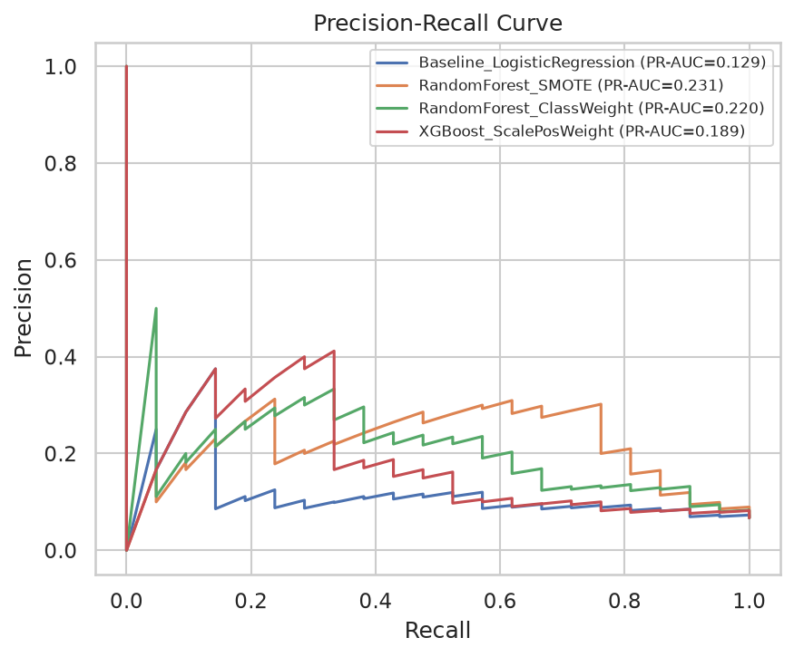</td>
<td width="50%">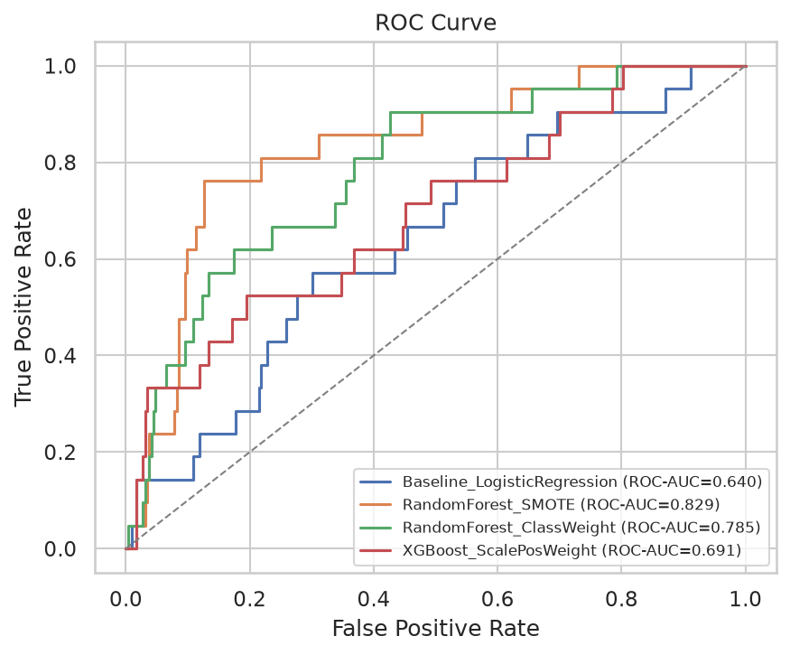</td>
</tr>
</table>

#### 최종 모델(RandomForest_SMOTE) Confusion Matrix

threshold 0.5, test 314건 기준입니다.

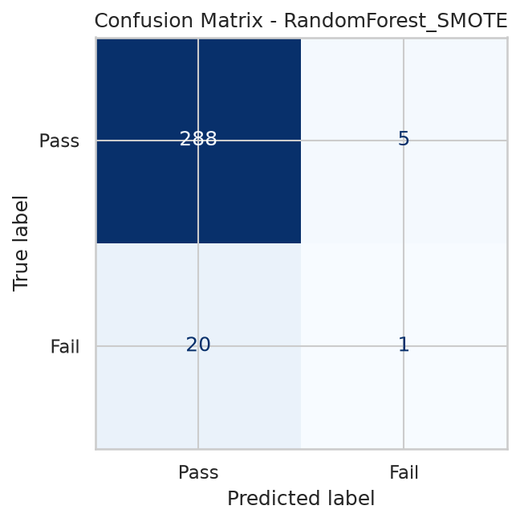

## 8. 최종 모델의 Threshold 선택 근거

최종으로 고른 RandomForest_SMOTE도 threshold 0.5에서는 Recall이 0.048입니다. test 샘플 중 실제 Fail
21건 중 1건만 잡아낸다는 의미이고(FN=20), threshold 0.5 기준 Recall은 운영 판단에 활용하기 어려운
수준입니다. 하지만 threshold를 낮추면 결과가 달라집니다. Recall은 올라가는데 그만큼 False Positive(오탐,
불필요한 검사비용)도 같이 늘어나는 트레이드오프가 뚜렷하게 나타납니다. 0.05부터 0.95까지 전 구간을 훑어서
`outputs/metrics/threshold_tuning_RandomForest_SMOTE.csv`와
`outputs/figures/threshold_tuning_RandomForest_SMOTE.png`에 남겨뒀습니다.

**이 threshold tuning은 hold-out test set의 예측 확률로 계산했습니다.** 즉 test set으로 모델 성능을
평가하면서 같은 test set으로 threshold도 골랐기 때문에, 아래 표의 Recall/Precision/F1을 완전히 독립적인
최종 운영 성능으로 해석하지는 않습니다. 참고용 탐색 결과로 남겨두는 것이며, 더 엄밀하게 하려면 학습 데이터
내부 validation fold의 예측값으로 threshold를 정하고 test set은 마지막 1회 확인에만 써야 합니다.

| 전략 | Threshold | Recall | Precision | F1 | FP | FN |
|---|---|---|---|---|---|---|
| F1 최대화 | 0.35 | 0.619 | 0.283 | 0.388 | 33 | 8 |
| Recall 우선 (Precision ≥ 0.2 유지) | 0.30 | 0.810 | 0.210 | 0.333 | 64 | 4 |
| Precision 우선 (Recall ≥ 0.5 유지) | 0.35 | 0.619 | 0.283 | 0.388 | 33 | 8 |

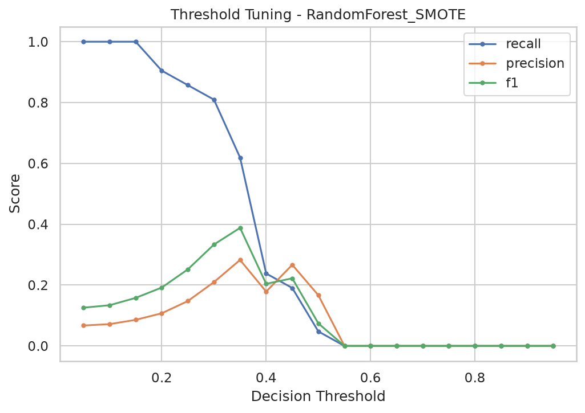

기본값 0.5 대신 0.30~0.35 정도로 낮추면 Recall은 0.048에서 0.619~0.810으로 증가합니다. 이 프로젝트에서는
F1이 가장 높은 threshold=0.35를 기본 참고값으로 잡았는데, 그래도 FP 33건은 후속 정밀검사 부담으로 남고
FN 8건은 여전히 못 잡는 불량으로 남습니다.

#### 비즈니스 목적별 임계값 선택 논리

불량을 놓쳤을 때 비용(고객 클레임, 리콜)이 크다면 Recall을 우선해서 임계값을 낮추고, 대신 늘어난 False
Positive는 후속 정밀 검사 단계에서 걸러내는 게 낫습니다. 반대로 검사 인력이나 장비가 부족하다면 Precision을
우선해서 임계값을 높여 검사 대상 자체를 줄이는 편이 맞을 겁니다. 둘 사이 균형이 중요하다면 F1이 가장 높은
지점을 기준으로 삼으면 됩니다. 이 프로젝트는 단일 최적 임계값을 못 박지 않고, 위 표를 근거로 비용 구조에
맞게 직접 고를 수 있도록 threshold tuning 결과를 남겨두는 데 더 신경 썼습니다.

## 9. Feature Importance 해석 시 유의사항

`outputs/metrics/feature_importance.csv`와 `outputs/figures/feature_importance_<model>.png`에 있는 순위는
SHAP(가능하면)이나 Permutation Importance(그 외 경우)로 계산한, 익명화된 `feature_XXX` ID 기준의 통계적
중요도일 뿐입니다. **이 순위를 실제 물리적 공정 인과관계로 해석하지 않습니다.** "feature_XXX가 중요하다"는
건 이 모델이 그 변수의 변화에 민감하게 반응한다는 통계적 사실이지, 그 변수가 실제로 어떤 공정을 나타내는지는
이 데이터셋만으로는 알 수 없습니다.

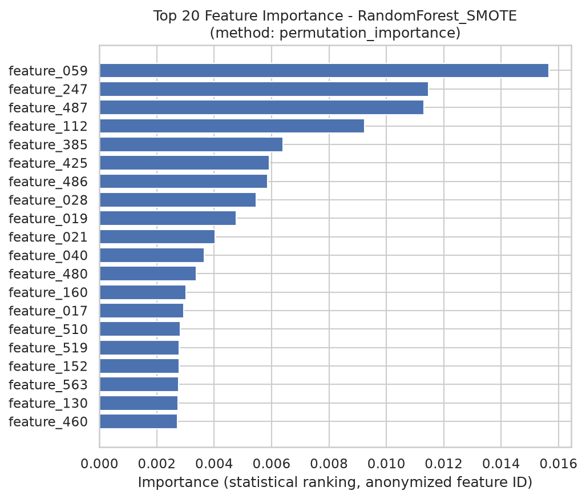

이 프로젝트가 만드는 인터랙티브 산출물은 성격이 다른 두 갈래입니다. 하나는 **Spotfire**(TIBCO의 외부 BI
툴, 별도 설치·라이선스 필요)로, 이 저장소는 여기에 넣을 CSV와 만드는 방법만 제공하고 실제 대시보드 구성은
사용자가 Spotfire에서 직접 합니다. 다른 하나는 **Plotly/Dash**로, 전부 이 저장소의 Python 코드가 자동
생성하며 Python 및 패키지(`pip install -r requirements.txt`) 설치 후 로컬 환경에서 바로 실행됩니다. 둘 다
데이터 출처는 동일하게 실제 SECOM 학습 결과지만, 만드는 방식과 실행 환경은 완전히 다릅니다.

## 10. Spotfire 대시보드 구성 (외부 BI 툴)

`data/processed/`에 Spotfire에서 바로 불러올 수 있는 CSV 3개(`secom_spotfire_master.csv`,
`secom_feature_summary.csv`, `secom_model_performance.csv`)를 만들어둡니다. KPI 카드, 차트별 설정, 오분류
필터링 같은 대시보드 구성 방법은 [`reports/spotfire_dashboard_guide.md`](reports/spotfire_dashboard_guide.md)에
정리했습니다. 아래는 가이드를 따라 Spotfire 프로그램상에서 실제로 만든 화면입니다.

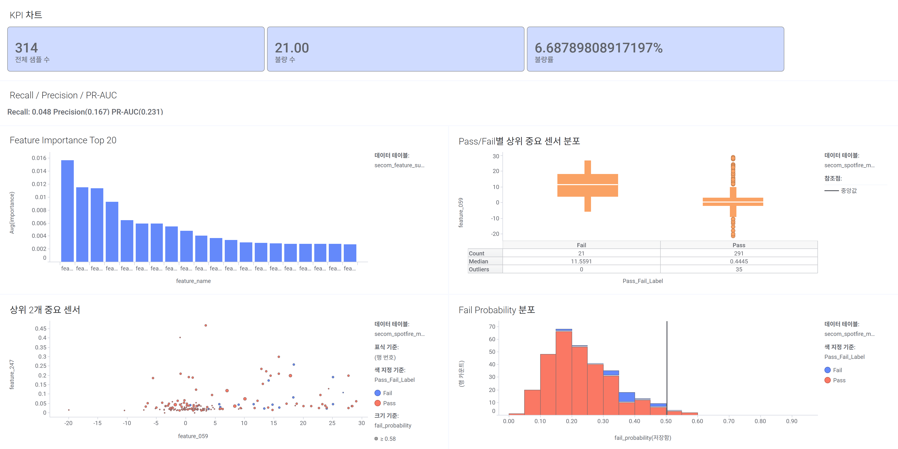

## 11. Interactive Analytics (저장소 코드 기반, Plotly Dash)

Spotfire와 달리 아래는 전부 이 저장소 안의 스크립트가 만듭니다. 별도 BI 툴이나 라이선스가 필요 없고, 데이터는
동일하게 실제 SECOM 데이터와 학습된 모델 결과를 씁니다.

### 독립 실행형 Plotly HTML (`outputs/interactive/`)

`python dashboard/build_static_reports.py`로 만들어지고, Plotly.js를 CDN에서 불러오기 때문에 인터넷 연결
환경에서는 별도 서버 없이 파일을 브라우저에서 열기만 해도 동작합니다.

| 파일 | 내용 |
|---|---|
| `interactive_feature_distribution.html` | 중요도 상위 8개 익명 센서를 드롭다운으로 선택해 Pass/Fail별 Violin Plot으로 비교 |
| `interactive_scatter_matrix.html` | 중요도 상위 5개 센서의 Scatter Matrix (색상=실제 라벨, 마커 모양=예측 정오답), test split 전량(314건, 샘플링 불필요) 표시 |
| `prediction_probability_dashboard.html` | Fail Probability 분포, Precision-Recall 곡선, Threshold 슬라이더(0.05~0.95, 움직이면 Recall/Precision/F1/FP/FN이 즉시 갱신), 오분류(FP/FN/TP/TN) 필터링 테이블 |
| `feature_importance.html` | 최종 모델의 Top 20 Feature Importance ("importance does not establish physical causality" 명시) |

### Dash 대시보드 (`dashboard/`)

```bash
python dashboard/app.py
# http://127.0.0.1:8050 접속
```

KPI 카드, 실제/예측 라벨·오분류 유형·Fail Probability·센서 필터, 6종 차트(센서 분포, Fail Probability 분포,
Confusion Matrix, Feature Importance, 2-센서 Scatter, Threshold-Performance 곡선), CSV로 내려받을 수 있는
상세 테이블까지 들어 있습니다. 자세한 사용법과 스크린샷은 [`dashboard/README.md`](dashboard/README.md)에서
볼 수 있습니다.

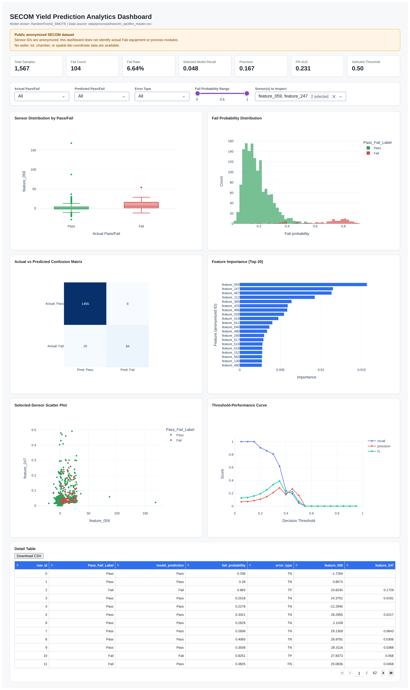

## 12. 재현 방법

```bash
# 1. 저장소 클론 및 의존성 설치
git clone <this-repo>
cd secom-yield-prediction
python -m venv .venv && source .venv/bin/activate  # Windows: .venv\Scripts\activate
pip install -r requirements.txt

# 2. 데이터 배치 (data/README.md 참고)
#    data/raw/uci-secom.csv (Kaggle) 또는
#    data/raw/secom.data + data/raw/secom_labels.data (UCI 원본)

# 3. 전체 파이프라인 한 번에 실행 (EDA 요약 제외, 모델 학습부터 Spotfire 산출물까지)
python src/train.py

# 4. (선택) 노트북으로 단계별 탐색
jupyter lab notebooks/01_eda.ipynb
jupyter lab notebooks/02_modeling.ipynb

# 5. 테스트 실행
pytest tests/ -q

# 6. (선택) 인터랙티브 Plotly HTML + docs/ 정적 사이트 생성
python dashboard/build_static_reports.py
python docs/build_pages_site.py

# 7. (선택) Dash 대시보드 로컬 실행
python dashboard/app.py   # http://127.0.0.1:8050
```

`python src/train.py` 하나만 돌리면 모델 학습, 평가, `outputs/`(그래프·메트릭·모델), `data/processed/`
(Spotfire CSV)까지 전부 생성됩니다. `random_state=42`를 고정했으며, 동일한 데이터와 주요 라이브러리 버전
환경에서 재현 가능한 실행을 목표로 구성했습니다.

## 13. 폴더 구조

```
secom-yield-prediction/
├── README.md
├── requirements.txt
├── .gitignore
├── data/
│   ├── README.md            # 데이터 다운로드/배치 안내
│   ├── raw/                 # 원본 데이터 (Git 추적 제외)
│   └── processed/           # Spotfire 연계용 정제 데이터
├── notebooks/
│   ├── 01_eda.ipynb
│   └── 02_modeling.ipynb
├── src/
│   ├── config.py             # 경로/상수/random_state 설정
│   ├── data_loader.py        # 원본 데이터 로드 및 라벨 변환
│   ├── preprocess.py         # EDA 통계 + 누수 방지 전처리/모델 파이프라인
│   ├── train.py               # 전체 파이프라인 실행 엔트리포인트
│   ├── evaluate.py            # 메트릭/threshold tuning/시각화
│   └── utils.py                # 공통 유틸 (seed, JSON, figure 저장)
├── reports/
│   ├── spotfire_dashboard_guide.md
│   ├── model_experiment_log.md
│   └── spotfire_example.png    # 실제로 구성한 Spotfire 대시보드 스크린샷
├── dashboard/                  # SECOM 실제 데이터 기반 인터랙티브 분석
│   ├── app.py                   # Plotly Dash 로컬 대시보드
│   ├── data_loader.py            # data/processed/ CSV 로딩
│   ├── components.py              # 재사용 UI 컴포넌트
│   ├── build_static_reports.py    # outputs/interactive/*.html 생성 스크립트
│   └── README.md
├── docs/                        # (선택) GitHub Pages 정적 사이트
│   ├── build_pages_site.py
│   └── index.html (+ 인터랙티브 HTML 사본)
├── outputs/
│   ├── figures/               # PNG 그래프
│   ├── metrics/                # JSON/CSV 메트릭
│   ├── models/                  # 학습된 파이프라인(.joblib)
│   └── interactive/              # 독립 실행형 Plotly HTML
└── tests/
    └── test_data_pipeline.py
```
