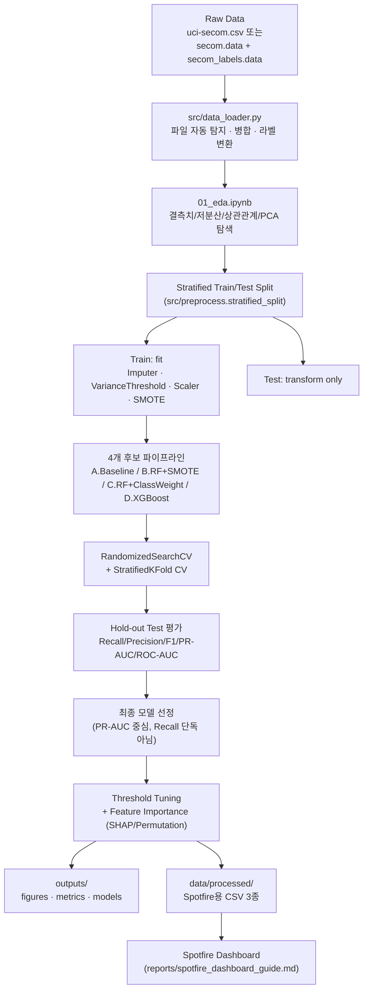

# SECOM 기반 반도체 공정 센서 데이터 불량 예측 및 불균형 분류 분석

> 공개·익명화된 UCI/Kaggle SECOM 데이터셋으로, 590개 센서 변수에서 불량(Fail) 판별에 기여하는 패턴을
> 모델링하고 불균형 분류(imbalanced classification) 문제를 다루는 방법을 실험한 End-to-End 데이터 분석/ML 파이프라인.

**⚠️ 이 프로젝트는 실제 Fab 원천 데이터가 아닌, 공개·익명화된 데이터셋 기반의 분석입니다.** 590개 센서 feature는
실제 어떤 장비/공정/챔버를 의미하는지 공개되어 있지 않으며, 본 저장소의 모든 해석은 "가상 공정 수율 분석
시뮬레이션"으로 한정됩니다. 실제 반도체 Fab 공정의 원인을 규명한 결과가 아닙니다.

---

## 목차

1. [프로젝트 배경 및 문제 정의](#1-프로젝트-배경-및-문제-정의)
2. [데이터셋 설명 및 한계](#2-데이터셋-설명-및-한계)
3. [분석 아키텍처 / 프로세스](#3-분석-아키텍처--프로세스)
4. [EDA 핵심 인사이트](#4-eda-핵심-인사이트)
5. [전처리 전략](#5-전처리-전략)
6. [모델링 전략 및 데이터 누수 방지 원칙](#6-모델링-전략-및-데이터-누수-방지-원칙)
7. [모델 성능 비교](#7-모델-성능-비교)
8. [최종 모델의 Threshold 선택 근거](#8-최종-모델의-threshold-선택-근거)
9. [Feature Importance 해석 시 유의사항](#9-feature-importance-해석-시-유의사항)
10. [Spotfire 대시보드 구성](#10-spotfire-대시보드-구성)
10-1. [Interactive Analytics](#interactive-analytics)
10-2. [Synthetic Wafer Map Demonstration](#synthetic-wafer-map-demonstration)
11. [재현 방법](#11-재현-방법)
12. [폴더 구조](#12-폴더-구조)
13. [향후 개선 방향](#13-향후-개선-방향)
14. [면접용 30초 설명](#14-면접용-30초-설명)
15. [이력서용 프로젝트 기술](#15-이력서용-프로젝트-기술)

---

## 1. 프로젝트 배경 및 문제 정의

반도체 제조 공정은 웨이퍼 한 장이 완성되기까지 수백 개의 공정 단계와 센서 계측을 거칩니다. 공정 중 수집되는
센서 데이터(Sensor data)를 활용해 최종 검사 전에 불량(Fail) 가능성이 높은 제품을 조기에 식별할 수 있다면,
검사 비용과 수율(Yield) 손실을 줄이는 데 도움이 될 수 있습니다.

이 프로젝트는 이러한 문제의식을 **공개 데이터셋인 SECOM(UCI/Kaggle)**으로 재현합니다. 목표는 다음과 같습니다.

- 590개의 익명화된 센서 변수와 공정 타임스탬프(Time)를 기반으로 Pass/Fail을 예측하는 분류 모델을 구축한다.
- 불량 클래스가 전체의 6~7%에 불과한 **심각한 클래스 불균형(class imbalance)** 상황에서, 단순 정확도(Accuracy)가
  아닌 Recall/Precision/F1/PR-AUC/ROC-AUC를 함께 고려하여 모델을 비교·선택하는 절차를 정립한다.
- 결측치 처리, 고차원(590개) 피처, 데이터 누수(leakage) 방지 등 실무형 데이터 파이프라인 설계 역량을 보여준다.
- 분석 결과를 코드/노트북에 그치지 않고 Spotfire 대시보드로 연계할 수 있는 형태로 산출한다.

## 2. 데이터셋 설명 및 한계

- **출처**: [UCI Machine Learning Repository - SECOM](https://archive.ics.uci.edu/dataset/179/secom) /
  [Kaggle - uci-semcom](https://www.kaggle.com/datasets/paresh2047/uci-semcom)
- **구성**: 1,567개 샘플 x 590개 익명 센서 feature + `Time`(타임스탬프) + `Pass/Fail`(라벨: -1=정상, 1=불량)
- **라벨 변환**: 원본 라벨 `-1`(정상) → `0`(Pass), `1`(불량) → `1`(Fail)로 변환하여 사용 (`src/data_loader.convert_labels`)
- **클래스 불균형**: 불량(Fail) 비율이 전체의 약 6~7% 수준으로 매우 낮습니다.

**한계 (반드시 숙지)**

- 590개 feature는 익명화되어 있어 실제 어떤 공정/장비/챔버를 의미하는지 알 수 없습니다. 본 프로젝트는 이를
  **특정 공정으로 단정하지 않고, "익명화된 센서 변수"로만 취급**합니다.
- Wafer X/Y 좌표, 장비 ID, Chamber ID, Lot ID 등 실제 제조 추적(traceability)에 필요한 메타데이터가 없습니다.
- 데이터 수집 시점(2008년경)과 특정 소규모 Fab 환경에 한정되어, 일반적인 반도체 공정 전체를 대표한다고
  볼 수 없습니다.
- 따라서 이 프로젝트의 결론은 **"공개 데이터에서 불량 판별에 통계적으로 기여하는 센서 패턴을 모델링했다"**로
  한정되며, 실제 Fab 공정의 물리적 인과관계를 규명한 것이 아닙니다.

## 3. 분석 아키텍처 / 프로세스



## 4. EDA 핵심 인사이트

> 아래는 실제 SECOM 데이터(`data/raw/uci-secom.csv`)로 `notebooks/01_eda.ipynb`를 실행해 확인한 결과입니다
> (`outputs/metrics/eda_summary.json`).

- **행/열**: 1,567개 샘플 x 590개 센서 feature (Time, Pass_Fail 등 메타 컬럼 포함 총 595열). 중복 행은 없음.
- **클래스 불균형**: Pass 1,463건 vs Fail 104건 → **불량률 6.64%**. 정확도만으로는 다수 클래스(Pass)만 맞혀도
  93% 이상이 나오므로 별도의 불균형 대응 지표가 필수적임을 확인.
- **결측치**: feature별 결측 비율은 평균 4.5%, 중앙값 0.38%로 대부분 낮지만 **최댓값 91.2%**까지 존재해
  일부 센서는 사실상 사용 불가능한 수준. 임계값별 제거 대상 feature 수는 다음과 같음.

  | 결측 비율 임계값 | 제거 대상 | 유지 |
  |---|---|---|
  | 40% | 32개 | 558개 |
  | 50% (모델링 기본값) | 28개 | 562개 |
  | 70% | 8개 | 582개 |

- **상수/저분산 변수**: 127개 feature가 상수이거나 분산이 거의 0에 가까워 예측에 기여하지 못함 → 제거 대상.
- **고상관 변수쌍**: 분산 상위 feature 기준 `|corr| > 0.95`인 쌍이 329개 발견됨 → 다중공선성이 상당히 높은
  고차원 데이터임을 시사.
- **PCA 2D 투영**: 상위 2개 주성분이 설명하는 분산은 각각 5.6%, 3.6%(합 9.2%)에 불과했고, Pass/Fail이 2D
  투영에서 시각적으로 분리되지 않음. **이는 "모델이 잘 분류할 수 있다"는 증거로 과장 해석하지 않으며**,
  오히려 저차원 선형 투영만으로는 클래스가 분리되지 않는 어려운 문제임을 보여줌.
- **시간 구조**: 데이터는 약 337일에 걸쳐 수집되었고 시간순 정렬이 되어 있지 않음(`is_monotonic_time=False`).
  월별 불량률은 2.0%~14.0% 사이에서 변동(표준편차 약 3.7%p)하지만 뚜렷한 추세성 드리프트로 보기는 어려워,
  기본 평가 전략으로 **Stratified Random Split**을 채택함 (시간 기반 분할이 명백히 더 적합하다는 근거가
  부족했기 때문).

## 5. 전처리 전략

| 단계 | 방법 | 비고 |
|---|---|---|
| 컬럼명 생성 | `feature_000` ~ `feature_589` 명시적 이름 부여 | `src/data_loader.generate_feature_names` |
| 결측치 처리 | Median Imputation (train에서만 fit) | `sklearn.impute.SimpleImputer` |
| 고결측 변수 제거 | 결측 비율 임계값(기본 50%) 초과 컬럼 제거, train에서만 기준 산정 | `src/preprocess.MissingRatioDropper` (커스텀 transformer) |
| 저분산/상수 변수 제거 | 분산이 거의 0인 변수 제거 | `sklearn.feature_selection.VarianceThreshold` (결측 존재 시 `LowVarianceDropper`) |
| 스케일링 | Logistic Regression 등 스케일에 민감한 모델에만 적용 | `StandardScaler` |
| 불균형 처리 | SMOTE(오버샘플링) 또는 `class_weight='balanced'` 두 가지 방식을 비교 | `imblearn.over_sampling.SMOTE` |

**결측치 비율 임계값 비교**: 40%/50%/70% 세 기준에서 제거되는 변수 수를 비교했습니다 (`config.MISSING_RATIO_THRESHOLDS`).
모델링 파이프라인은 50%를 기본값으로 사용합니다 (`config.MODELING_MISSING_THRESHOLD`).

## 6. 모델링 전략 및 데이터 누수 방지 원칙

**데이터 누수(Data Leakage) 방지 원칙**

1. 결측치 보정(median), 저분산/상수 변수 제거, 스케일링, SMOTE는 **모두 학습(train) 세트에서만 `.fit()`**하고,
   검증/테스트 세트에는 **`.transform()`만 적용**합니다. `MissingRatioDropper` 등 커스텀 transformer도 같은 원칙을 따릅니다.
2. **SMOTE는 train/test 분할 이후**, 그리고 `StratifiedKFold` 교차검증의 **각 fold 내부에서만** 적용됩니다
   (`imblearn.pipeline.Pipeline`을 사용해 SMOTE를 파이프라인 스텝으로 넣음으로써 CV 중 fold 간 누수를 방지).
3. Feature selection(결측 임계값, 분산 임계값)도 파이프라인 스텝으로 구현되어 train 폴드에서만 기준이 산정됩니다.

**비교 모델 (4개)**

| 이름 | 전처리 | 불균형 처리 | 모델 |
|---|---|---|---|
| A. Baseline_LogisticRegression | Median 보정 + 상수 제거 + 스케일링 | 없음 (naive 기준선) | Logistic Regression |
| B. RandomForest_SMOTE | Median 보정 + 상수 제거 | SMOTE (train fold 내부만) | Random Forest |
| C. RandomForest_ClassWeight | Median 보정 + 상수 제거 | `class_weight='balanced'` | Random Forest |
| D. XGBoost_ScalePosWeight | 상수 제거만 (native missing 처리) | `scale_pos_weight` | XGBoost |

B와 C는 동일한 모델(Random Forest)에 SMOTE vs class-weight를 각각 적용해 **직접 비교**할 수 있도록 설계했습니다.

**하이퍼파라미터 튜닝**: 학습 데이터가 작고(약 1,250건) 불량 클래스가 적어(약 80~90건) 과도한 GridSearch는
과적합 위험이 있으므로, 작은 탐색 공간의 `RandomizedSearchCV` + `StratifiedKFold`(5-fold)를 사용했습니다.

**시간 기반 분할 검토**: `Time` 컬럼의 순서성과 월별 불량률 추이를 확인한 뒤(`src/preprocess.analyze_time_structure`),
뚜렷한 시간 추세가 확인되지 않아 기본 평가는 **Stratified Random Split**을 사용했습니다. `Time`은 원본 형태를
보존하며, 파생 변수(연/월/일/시간 등)를 만들 경우의 의미와 한계는 `notebooks/01_eda.ipynb`에 문서화되어 있습니다.

## 7. 모델 성능 비교

> 아래 표는 `outputs/metrics/model_comparison.csv` (실제 SECOM 데이터, hold-out test 314건 기준)를 옮긴
> 것입니다. Threshold는 기본값 0.5 기준입니다 — §8에서 threshold tuning으로 이 수치가 어떻게 개선되는지
> 다룹니다.

| Model | Preprocessing | Sampling/Weighting | Recall | Precision | F1 | PR-AUC | ROC-AUC | FP | FN | CV PR-AUC (mean±std) |
|---|---|---|---|---|---|---|---|---|---|---|
| Baseline_LogisticRegression | median_impute+variance_threshold+scale | none | 0.143 | 0.273 | 0.188 | 0.129 | 0.640 | 8 | 18 | 0.161 ± 0.066 |
| **RandomForest_SMOTE (최종 선정)** | median_impute+variance_threshold | SMOTE (train fold only) | 0.048 | 0.167 | 0.074 | **0.231** | 0.829 | 5 | 20 | 0.212 ± 0.046 |
| RandomForest_ClassWeight | median_impute+variance_threshold | class_weight=balanced | 0.000 | 0.000 | 0.000 | 0.220 | 0.785 | 1 | 21 | 0.214 ± 0.065 |
| XGBoost_ScalePosWeight | variance_threshold_only (native missing handling) | scale_pos_weight | 0.000 | 0.000 | 0.000 | 0.189 | 0.691 | 3 | 21 | 0.201 ± 0.052 |

**해석 원칙**: 모델 선택은 Recall 단독이 아니라 **PR-AUC를 1차 기준**으로 삼고, F1/Precision/False Positive
부담을 함께 검토했습니다. 클래스 불균형이 심한 경우 ROC-AUC는 실제보다 낙관적으로 보일 수 있어(다수 클래스가
쉽게 맞혀지므로), PR-AUC와 Recall/Precision을 함께 보는 것이 더 신뢰할 수 있습니다.

**관찰된 특징**: 기본 threshold(0.5) 기준으로는 SMOTE/class-weight 모델의 Recall이 오히려 Baseline보다
낮게 보입니다(0.5는 SMOTE·class-weight가 만든 확률 분포에 맞는 임계값이 아니기 때문). 반면 **PR-AUC**(모든
threshold를 aggregate한 지표)는 RandomForest_SMOTE가 가장 높아, "0.5 고정 Recall"만 보면 놓치는 실제
분리력 차이를 보여줍니다. 이는 threshold tuning이 왜 필수적인지를 그대로 보여주는 결과입니다 (§8 참고).
같은 Random Forest에 SMOTE(0.231)와 class_weight(0.220)를 각각 적용했을 때 PR-AUC 차이는 크지 않았고,
SMOTE 쪽이 근소하게 우위였습니다.

## 8. 최종 모델의 Threshold 선택 근거

최종 선정 모델(RandomForest_SMOTE)의 기본 임계값(0.5) 성능은 Recall=0.048로 매우 낮습니다 — 314건의 test
샘플 중 실제 Fail 21건 중 단 1건만 검출(FN=20)합니다. 반면 임계값을 낮추면 Recall(불량 검출률)이 올라가지만
False Positive(오탐, 불필요한 검사비용)가 함께 증가하는 **트레이드오프**가 뚜렷하게 나타납니다.
`outputs/metrics/threshold_tuning_RandomForest_SMOTE.csv`와
`outputs/figures/threshold_tuning_RandomForest_SMOTE.png`에 0.05~0.95 구간 전체를 기록했습니다.

| 전략 | Threshold | Recall | Precision | F1 | FP | FN |
|---|---|---|---|---|---|---|
| F1 최대화 | 0.35 | 0.619 | 0.283 | 0.388 | 33 | 8 |
| Recall 우선 (Precision ≥ 0.2 유지) | 0.30 | 0.810 | 0.210 | 0.333 | 64 | 4 |
| Precision 우선 (Recall ≥ 0.5 유지) | 0.35 | 0.619 | 0.283 | 0.388 | 33 | 8 |

기본값 0.5 대신 **0.30~0.35** 구간을 쓰면 Recall이 0.05 수준에서 0.62~0.81 수준으로 크게 개선되며, 이
프로젝트에서는 F1이 최대화되는 **threshold=0.35**를 기본 참고값으로 제시합니다 (FP 33건은 후속 정밀검사
부담, FN 8건은 여전히 남는 미검출 불량으로 해석).

**비즈니스 목적별 임계값 선택 논리**

- 불량을 놓치는 비용(고객 클레임, 리콜)이 매우 크다면 → Recall을 우선하는 **낮은 임계값**을 선택하고, 늘어난
  False Positive는 후속 정밀 검사 단계에서 필터링.
- 검사 인력/장비 리소스가 제한적이라면 → Precision을 우선하는 **높은 임계값**을 선택해 검사 대상을 줄임.
- 두 목표의 균형이 필요하다면 → F1이 최대가 되는 임계값을 기준점으로 사용.

이 프로젝트는 하나의 "정답 임계값"을 제시하지 않고, 위 표를 근거로 의사결정자가 비용 구조에 맞게 선택할 수
있도록 threshold tuning 결과를 제공하는 데 중점을 둡니다.

## 9. Feature Importance 해석 시 유의사항

- `outputs/metrics/feature_importance.csv` 및 `outputs/figures/feature_importance_<model>.png`는 SHAP(가능한 경우)
  또는 Permutation Importance(대체)로 계산된 **익명화된 `feature_XXX` ID 기준의 통계적 중요도 순위**입니다.
- **이 순위를 실제 물리적 공정 인과관계로 해석하지 않습니다.** "feature_XXX가 중요하다"는 것은 이 모델이 이
  변수의 변화에 민감하게 반응한다는 통계적 사실일 뿐, 해당 변수가 어떤 실제 공정을 나타내는지는 이 데이터셋에서
  알 수 없습니다.

## 10. Spotfire 대시보드 구성

`data/processed/`에 Spotfire에서 바로 불러올 수 있는 3개의 CSV(`secom_spotfire_master.csv`,
`secom_feature_summary.csv`, `secom_model_performance.csv`)를 생성합니다. 상세한 대시보드 구성 방법(KPI 카드,
차트별 설정, 오분류 필터링 등)은 [`reports/spotfire_dashboard_guide.md`](reports/spotfire_dashboard_guide.md)를
참고하세요. **Wafer map, Chamber traceback 등 이 데이터셋에 없는 정보를 만들어내지 않도록 주의사항을 포함하고
있습니다.**

## Interactive Analytics

**아래는 모두 실제 SECOM 데이터와 학습된 모델 결과를 기반으로 합니다.** (§10-2의 합성 웨이퍼 데모와는
완전히 별개이며, 절대 같은 표/문장에서 혼합하지 않습니다 — 자세한 구분 기준은
[`docs/dashboard_and_simulation_scope.md`](docs/dashboard_and_simulation_scope.md) 참고.)

### 독립 실행형 Plotly HTML (`outputs/interactive/`)

`python dashboard/build_static_reports.py`로 생성되며, CDN 방식 Plotly를 사용해 브라우저에서 파일을 직접
열기만 하면 동작합니다 (서버 불필요).

| 파일 | 내용 |
|---|---|
| `interactive_feature_distribution.html` | 중요도 상위 8개 익명 센서를 드롭다운으로 선택해 Pass/Fail별 Violin Plot으로 비교 |
| `interactive_scatter_matrix.html` | 중요도 상위 5개 센서의 Scatter Matrix (색상=실제 라벨, 마커 모양=예측 정오답), test split 전량(314건, 샘플링 불필요) 표시 |
| `prediction_probability_dashboard.html` | Fail Probability 분포, Precision-Recall 곡선, **Threshold 슬라이더**(0.05~0.95, 움직이면 Recall/Precision/F1/FP/FN이 즉시 갱신), 오분류(FP/FN/TP/TN) 필터링 테이블 |
| `feature_importance.html` | 최종 모델의 Top 20 Feature Importance ("importance does not establish physical causality" 명시) |

### Dash 대시보드 (`dashboard/`)

```bash
python dashboard/app.py
# http://127.0.0.1:8050 접속
```

KPI 카드, 실제/예측 라벨·오분류 유형·Fail Probability·센서 필터, 6종 차트(센서 분포, Fail Probability 분포,
Confusion Matrix, Feature Importance, 2-센서 Scatter, Threshold-Performance 곡선), CSV 다운로드가 가능한 상세
테이블을 제공합니다. 자세한 사용법과 스크린샷은 [`dashboard/README.md`](dashboard/README.md) 참고.


### GitHub Pages (선택 사항)

`docs/` 폴더에 위 4개 SECOM HTML과 합성 웨이퍼 데모 HTML, `index.html`을 정적 사이트 형태로 미리 구성해
두었습니다 (`python docs/build_pages_site.py`로 재생성). GitHub Pages를 켜려면:

1. GitHub 저장소 → **Settings → Pages**
2. **Source**: `Deploy from a branch`, **Branch**: 배포할 브랜치, 폴더는 `/docs` 선택
3. 저장 후 몇 분 내로 `https://<username>.github.io/<repo>/`에서 확인 가능

(본 세션에서는 remote push나 저장소 설정 변경을 수행하지 않았습니다 — 위 절차는 안내용입니다.)

## Synthetic Wafer Map Demonstration

**이 섹션은 SECOM 데이터와 독립적인, 코드로 생성한 합성(synthetic) 데이터 기반의 시각화 데모입니다.**
SECOM 데이터셋에는 Wafer 좌표, Die 좌표, Lot ID, 장비 ID, Chamber ID가 없으므로, 아래 모듈은 그런 정보를
SECOM에서 가져온 것이 아니라 **`simulations/generate_synthetic_wafer_data.py`가 고정 시드로 직접 생성**한
가상 데이터를 사용합니다.

- **목적**: 좌표 기반 wafer map 시각화, 배치(batch) PDF 리포팅, 공간 패턴(spatial pattern) 분류 로직 구현
  역량을 시연하는 것입니다.
- **한계**: 실제 Fab 데이터, 실제 계측/검사(DMI/inspection) 결과, 실제 장비 원인 규명 결과가 **아닙니다.**
  이 섹션의 어떤 수치도 SECOM 프로젝트의 성능 지표(§7, §8)와 같은 표나 문장에서 혼합해 인용하지 않습니다.

| 파일 | 내용 |
|---|---|
| `simulations/generate_synthetic_wafer_data.py` | `EDGE_RING`/`CENTER`/`SCRATCH`/`RANDOM`/`CLEAN` 5개 패턴의 다이 단위 PASS/FAIL 맵 생성, `data/processed/synthetic_wafer_map_demo.csv` 저장 |
| `simulations/wafer_map_visualizer.py` | Matplotlib 기반 wafer map PNG (`outputs/simulations/wafer_map_{pattern}.png`), 제목에 `[SYNTHETIC DEMO]` 명시 |
| `simulations/wafer_pattern_classifier.py` | 규칙 기반(rule-based) 패턴 분류 데모. `synthetic_data_flag=True`가 아닌 데이터는 예외 발생시켜 거부 |
| `simulations/batch_wafer_report.py` | 전체 웨이퍼를 묶은 다중 페이지 PDF (`outputs/simulations/synthetic_wafer_demo_report.pdf`), 모든 페이지 하단에 합성 데이터 문구 반복 |

실행:

```bash
python simulations/generate_synthetic_wafer_data.py
python simulations/wafer_map_visualizer.py
python simulations/wafer_pattern_classifier.py
python simulations/batch_wafer_report.py
```

## 11. 재현 방법

```bash
# 1. 저장소 클론 및 의존성 설치
git clone <this-repo>
cd secom-yield-prediction
python -m venv .venv && source .venv/bin/activate  # Windows: .venv\Scripts\activate
pip install -r requirements.txt

# 2. 데이터 배치 (data/README.md 참고)
#    data/raw/uci-secom.csv (Kaggle) 또는
#    data/raw/secom.data + data/raw/secom_labels.data (UCI 원본)

# 3. 전체 파이프라인 한 번에 실행 (EDA 요약 제외, 모델 학습부터 Spotfire 산출물까지)
python src/train.py

# 4. (선택) 노트북으로 단계별 탐색
jupyter lab notebooks/01_eda.ipynb
jupyter lab notebooks/02_modeling.ipynb

# 5. 테스트 실행
pytest tests/ -q

# 6. (선택) 인터랙티브 Plotly HTML + GitHub Pages 사이트 생성
python dashboard/build_static_reports.py
python docs/build_pages_site.py

# 7. (선택) Dash 대시보드 로컬 실행
python dashboard/app.py   # http://127.0.0.1:8050

# 8. (선택) 합성 웨이퍼맵 데모 (SECOM과 무관, UI/엔지니어링 데모)
python simulations/generate_synthetic_wafer_data.py
python simulations/wafer_map_visualizer.py
python simulations/wafer_pattern_classifier.py
python simulations/batch_wafer_report.py
```

`python src/train.py` 한 번 실행으로 모델 학습, 평가, `outputs/`(그래프·메트릭·모델), `data/processed/`
(Spotfire CSV)까지 전부 생성됩니다. `random_state=42`로 고정되어 있어 동일 환경에서 재현 가능합니다.

## 12. 폴더 구조

```
secom-yield-prediction/
├── README.md
├── requirements.txt
├── .gitignore
├── data/
│   ├── README.md            # 데이터 다운로드/배치 안내
│   ├── raw/                 # 원본 데이터 (Git 추적 제외)
│   └── processed/           # Spotfire 연계용 정제 데이터
├── notebooks/
│   ├── 01_eda.ipynb
│   └── 02_modeling.ipynb
├── src/
│   ├── config.py             # 경로/상수/random_state 설정
│   ├── data_loader.py        # 원본 데이터 로드 및 라벨 변환
│   ├── preprocess.py         # EDA 통계 + 누수 방지 전처리/모델 파이프라인
│   ├── train.py               # 전체 파이프라인 실행 엔트리포인트
│   ├── evaluate.py            # 메트릭/threshold tuning/시각화
│   └── utils.py                # 공통 유틸 (seed, JSON, figure 저장)
├── reports/
│   ├── spotfire_dashboard_guide.md
│   ├── portfolio_summary.md
│   └── model_experiment_log.md
├── dashboard/                  # SECOM 실제 데이터 기반 인터랙티브 분석
│   ├── app.py                   # Plotly Dash 로컬 대시보드
│   ├── data_loader.py            # data/processed/ CSV 로딩
│   ├── components.py              # 재사용 UI 컴포넌트
│   ├── build_static_reports.py    # outputs/interactive/*.html 생성 스크립트
│   └── README.md
├── simulations/                 # SECOM과 독립된 합성 웨이퍼맵 데모 [SYNTHETIC]
│   ├── generate_synthetic_wafer_data.py
│   ├── wafer_map_visualizer.py
│   ├── wafer_pattern_classifier.py
│   └── batch_wafer_report.py
├── docs/                        # (선택) GitHub Pages 정적 사이트
│   ├── build_pages_site.py
│   ├── dashboard_and_simulation_scope.md
│   └── index.html (+ 인터랙티브 HTML 사본)
├── outputs/
│   ├── figures/               # PNG 그래프 (SECOM)
│   ├── metrics/                # JSON/CSV 메트릭 (SECOM)
│   ├── models/                  # 학습된 파이프라인(.joblib) (SECOM)
│   ├── interactive/              # 독립 실행형 Plotly HTML (SECOM)
│   └── simulations/               # 합성 웨이퍼맵 PNG/PDF [SYNTHETIC]
└── tests/
    └── test_data_pipeline.py
```

## 13. 향후 개선 방향

- SHAP 기반 설명력 강화 (현재는 미설치 시 permutation importance로 자동 대체)
- 비용 민감(cost-sensitive) 임계값 최적화: FP/FN에 실제 비용 가중치를 부여한 임계값 자동 탐색
- 더 다양한 리샘플링 기법 비교 (ADASYN, Borderline-SMOTE 등)
- 모델 앙상블(스태킹) 실험
- CI(GitHub Actions)에 `pytest`와 `python src/train.py --smoke-test` 자동 실행 추가

## 14. 면접용 30초 설명

> "공개된 SECOM 반도체 센서 데이터셋으로 불량(Fail) 예측 파이프라인을 만들었습니다. 590개 익명 센서 변수에
> 불량 비율이 6~7%밖에 안 되는 심한 불균형 문제라서, 정확도 대신 PR-AUC·Recall·Precision을 함께 보고 모델을
> 선택했고, SMOTE와 class-weight 두 가지 불균형 처리 방식을 같은 모델로 비교했습니다. 결측치 보정·스케일링·
> SMOTE는 전부 학습 데이터에서만 fit해서 데이터 누수를 막았고, threshold를 하나로 고정하지 않고 Recall/Precision
> 트레이드오프 표를 만들어서 비즈니스 목적에 따라 선택할 수 있게 했습니다. 결과는 Jupyter 노트북, 재사용 가능한
> Python 파이프라인, Spotfire용 CSV까지 이어지도록 구성했습니다."

## 15. 이력서용 프로젝트 기술

**1줄 요약**

> SECOM 반도체 센서 데이터(590 feature, 불량률 6~7%)를 활용해 데이터 누수 없는 불균형 분류 파이프라인을
> 구축하고, PR-AUC 기반 모델 선택 및 threshold tuning으로 Recall-Precision 트레이드오프를 정량화함.

**STAR 방식 버전**

> **(S)** 반도체 공정 센서 데이터는 feature 수가 많고(590개) 불량 비율이 매우 낮아(6~7%) 단순 정확도로는 불량
> 탐지 성능을 제대로 평가할 수 없는 문제가 있었다.
> **(T)** 데이터 누수 없이 재현 가능한 전처리·모델링 파이프라인을 구축하고, Recall뿐 아니라 Precision/PR-AUC/
> False Positive 부담을 함께 고려해 실무적으로 방어 가능한 모델 선택 기준을 세우는 것이 목표였다.
> **(A)** median imputation·저분산 변수 제거·스케일링·SMOTE를 전부 train 세트에서만 fit하는 `imblearn` 파이프라인을
> 설계하고, SMOTE와 class-weight 두 방식을 Random Forest로 직접 비교했으며, RandomizedSearchCV + StratifiedKFold로
> 튜닝한 뒤 threshold를 0.05~0.95로 스윕해 Recall/Precision/F1 트레이드오프 표를 만들었다.
> **(R)** 최종적으로 PR-AUC 기준 최상위 모델을 선정하고, 그 근거와 비즈니스 목적별 threshold 선택 논리를
> README/보고서로 문서화했으며, 결과를 Spotfire에서 바로 활용 가능한 CSV로 연계했다.
