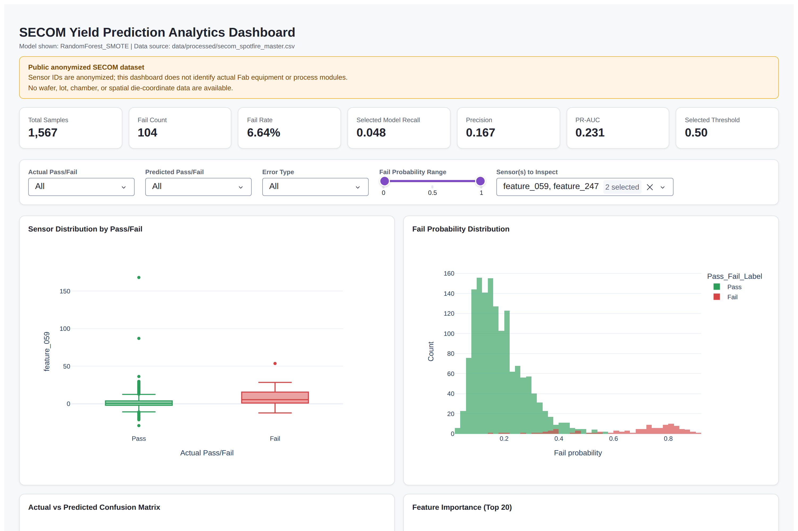

# SECOM Yield Prediction Analytics Dashboard (Dash)

로컬에서 실행하는 [Plotly Dash](https://dash.plotly.com/) 기반 대화형 대시보드입니다. `src/train.py`가
`data/processed/`에 생성한 실제 SECOM 결과(`secom_spotfire_master.csv`, `secom_model_performance.csv`,
`secom_feature_summary.csv`)만 읽어 시각화합니다 — 이 앱 자체는 예측을 재계산하지 않습니다.

## 사전 준비

```bash
pip install -r requirements.txt
python src/train.py   # data/processed/*.csv 가 이미 있다면 생략 가능
```

## 실행

```bash
python dashboard/app.py
```

콘솔에 `Dash is running on http://127.0.0.1:8050/`가 출력되면 브라우저에서 접속합니다.

```
http://127.0.0.1:8050
```

`data/processed/`에 필요한 CSV가 없으면 대시보드는 에러 대신 안내 메시지를 보여줍니다
(`python src/train.py` 실행을 안내).

## 파일 구성

| 파일 | 역할 |
|---|---|
| `app.py` | Dash 앱 본체 (레이아웃 + 콜백) |
| `data_loader.py` | `data/processed/` CSV 로딩, 존재하지 않을 때의 예외 처리 |
| `components.py` | KPI 카드, 배너, 필터 패널 등 재사용 UI 컴포넌트 |
| `build_static_reports.py` | `outputs/interactive/`에 저장되는 4개의 독립 실행형 Plotly HTML 생성 스크립트 |

## 화면 구성

1. **상단 배너**: 공개·익명화 데이터셋이라는 점과, Wafer/Lot/Chamber 좌표 데이터가 없다는 점을 항상 표시합니다.
2. **KPI 카드**: 전체 샘플 수, 불량 수, 불량률, 선택된 모델의 Recall/Precision/PR-AUC, 선택된 threshold.
3. **필터 영역**: 실제 라벨, 예측 라벨, 오분류 유형(TP/TN/FP/FN), Fail Probability 구간, 관심 센서 선택.
4. **차트 영역**: 센서 분포 Box Plot, Fail Probability 히스토그램, Confusion Matrix, Feature Importance Top 20,
   선택 센서 Scatter Plot, Threshold-Performance 곡선. 모든 차트는 상단 필터에 반응합니다.
5. **상세 테이블**: 필터링된 행 단위 데이터(최대 500행)를 정렬/페이지네이션과 함께 표시하며, CSV로 다운로드할 수 있습니다.

## 스크린샷

실제 SECOM 데이터(`data/processed/secom_spotfire_master.csv`)로 대시보드를 로컬 실행한 화면입니다.



전체 페이지(필터 + 6개 차트 + 상세 테이블 포함) 스크린샷은
[`screenshots/dashboard_overview.png`](screenshots/dashboard_overview.png)에서 확인할 수 있습니다.

## 주의사항

- 이 대시보드는 익명화된 SECOM 센서 데이터 기반이며, 실제 장비/챔버/공정을 특정하지 않습니다.
- `개발 서버(Flask development server)`로 실행되므로 프로덕션 배포용이 아닙니다. 외부 공유가 필요하면
  gunicorn 등 프로덕션 WSGI 서버 뒤에 `dashboard.app:server`를 연결하세요.
